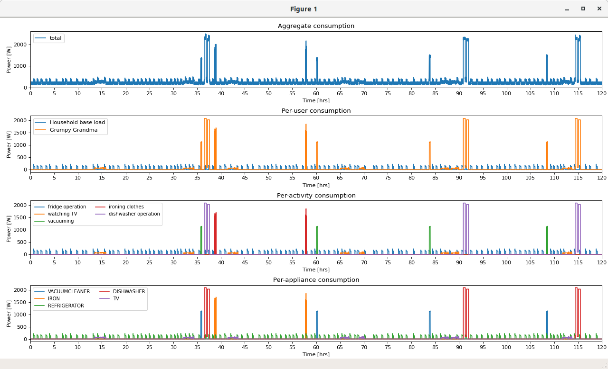

# ANTgen - the AMBAL-based NILM Trace generator

This tool generates synthetic macroscopic load signatures for their use in conjunction
with NILM (load disaggregation) tools. By default, it runs in scripted mode (i.e., with
no graphical user interface) and processes an input configuration file into a set of CSV
output files containing power consumption values and the timestamps of their occurrence,
as well as a file summarizing the events that have occurred during the simulation).

If you find this tool useful and use it (or parts of it), we ask you to cite the following work in your publications:
```bibtex
@inproceedings{reinhardt20benchmarking,
  author = {Andreas Reinhardt and Christoph Klemenjak},
  title = {How does Load Disaggregation Performance Depend on Data Characteristics? Insights from a Benchmarking Study},
  booktitle = {Proceedings of the 11th ACM International Conference on Future Energy Systems (e-Energy)},
  year = {2020}
}
```

## Requirements

ANTgen relies on a small number of Python libraries to fully function. Install them by typing:

```bash
pip3 install -r requirements.txt
```

Note: On Windows systems without a C/C++ compiler suite installed, the installation of package requirements may fail, 
reporting that the "Microsoft Visual C++ Build Tools" are missing. To continue, [download and install 
them](https://visualstudio.microsoft.com/visual-cpp-build-tools/), then re-run the above command.

ANTgen can show an overview plot of its generated data if `matplotlib` is installed.
So unless you plan to use ANTgen to create data on a headless server, we recommend the installation
of this library as well.

```bash
pip3 install matplotlib    # (optional, install only if you want to see your data plotted)
```

## Usage

```bash
python3 antgen.py [-o DESTINATION] [-w] [-s SEED] [-a] [-m MAPFILE] 
                  [-d DAYS] [-n NOISECONFIG] [-v] [-p] configfile
```

Mandatory argument:

* `configfile`: The configuration file to process (see next section for format)

Optional arguments:

* `-o <dir>` specifies the folder in which the output files shall be saved (`output/` by default)
* `-w` overwrite output files if they already exist
* `-s <123123123>` define the seed value for the random number generator
* `-a` randomly pick an appliance model each time the appliance is being operated (if unset, all operations of appliances of the same type will be exact replicas of each other)
* `-m <mapping.conf>` defines the mappings between appliances types and their AMBAL models (can be overwritten individually in the `[devices]` section of the configuration file)
* `-n <C123>` defines if noise shall be added to the aggregate signal. One letter (`C`=constant, `G`=Gaussian) followed by the amplitude in Watt
* `-d <123>` overrides the number of days for which to generate data (can also be given in the `[GENERAL]` section of the configuration file)
* `-p` opens a graphical interface to plot the resulting traces after their generation (requires `matplotlib`)
* `-v` makes ANTgen verbose and outputs more status information

## Configuration

All ANTgen configuration files are expected to be present in TOML format.
The core configuration file must feature at least the sections `[GENERAL]` and `[users]`.
Optionally, specific appliance models to be used can be placed in the `[devices]` section.
If `[devices]` is not part of the configuration file, a fallback mapping between
appliance names and the corresponding model dictionary must be provided by means
of the `-m` option, such as `-m mapping.conf`. This mapping file must contain a section
named `[devices]` to be processed correctly.

* In the `[GENERAL]` section, the configuration needs to be provided with a `name` and
the number of `days` for which data shall be generated. Optionally, the `seed` 
value for the random number generator can be specified to ensure a repeatable 
trace generation. When no seed is provided, the random number generator will 
initialize itself based on the current system time. If the number of days is neither
specified here nor on the command line (using `-d`), ANTgen will generate one day
worth of data only.

* The `[users]` section contains key-value pairs of user handles (only used for debugging)
and the corresponding user models (see next section for details). In order to allow
household base loads (refrigerator, etc) to run unattended, they should be added
as another (virtual) user, e.g., `Home`.

* An (optional) `[devices]` section can be added to list the appliance model *directories* to
consider, indexed by the **capitalized** appliance type. It is crucial to keep
the structure of the path intact, i.e., use exactly two levels of hierarchy, with
the first-level subdirectory indicating the type of modeled appliance, and
the second-level subdirectory referring to the individual handle from which
the data was extracted. The keys for each entry must be upper-case and reflect
the type of appliance that is being referred to. All AMBAL models must be located 
in the `appliances/` subdirectory.

An example configuration is shown as follows:
```
[GENERAL]
name = Sample configuration
days = 4
seed = 12345

[users]
Home = baseload.conf
Jack = STUDENT/student_simple.conf

[devices]
COOKINGSTOVE = COOKINGSTOVE/dev_D33097
TV = TV/dev_B80E51
```

This configuration file will create synthetic load signature data for four days, seeding
the random number generator with the value 12345. There are two users in the generated data,
one going by the handle "Jack" and following the daily routines specified in `users/STUDENT/student_simple.conf`.
The second "user" is present to model the household base load, as defined in `users/baseload.conf`.

## Users

To create realistic models, ANTgen relies on user models. All user models are stored in
the `users/` subdirectory, or subdirectories thereof. User models are stored in TOML
format, and must feature the `[GENERAL]` and `[presence]` sections, as well as one section
for each user activity that should be modeled (these ones must start with the string
`activity_`).

* In the `[GENERAL]` section, the user model must be provided with a `name`, which is
also reflected in the graphical user interface and the per-user power consumption output
file.

* The `[presence]` section contains key-value pairs of weekdays ("monday" through "sunday";
all in lower-case) and and the corresponding presence times. Times are specified in
24hr notation (from 00:00-24:00); multiple time ranges can be concatenated using commas.
These time frames indicate when a user can start/perform an activity.

* All activity sections must start with the `activity_` tag, followed by a unique
identifier (hint: this makes it easy to remove an activity temporarily by making it an
`inactivity_`). User activities are modeled separately (see below); the link between is
created by specifying the file name of the activity configuration using the `model` entry.
The `daily_runs` value states the average number of repetitions of this activity
throughout each day. There is no guarantee the activity will be scheduled *exactly* this
often during each simulated day. Lastly, activity occurrences can be time-limited by
specifying the hours during which the activity can take place for each day of the week,
using the same notation as for the `presence` tag above.

An example user model is shown as follows:

```
[GENERAL]
name = Lucas Lazybone

[presence]
monday   = 00:00-08:30, 14:00-24:00
sunday   = 00:00-24:00

[activity_breakfast]
model      = KITCHEN/cooking_quick.conf
daily_runs = 1
monday     = 07:30-08:15
sunday     = 08:30-09:15
```

This configuration models a user who is only at home on mondays and sundays, and cooks
breakfast once on both days at some (randomly determined) time in the specified time intervals.

## Activities

Activities are modeled as state machines, to be executed by the users. All activity
models must be stored in the `activities/ ` subdirectory, or subdirectories thereof.
Activity models also use the TOML format. 

As follows, find some notes on the used nomenclature and some general guidelines
for activity definitions:

1. The only entry the `[GENERAL]` section of each activity model must contain is the
`name` field. Enter a descriptive name of the activity, which will also constitute 
the corresponding file name for the power data when written to an output file.

2. Specify the types of appliances the activity requires in the `[devices]` section. The tool
will try to find matches for all entries listed there, so any unused leftover entries
can make the synthesis fail. Use unique numeric keys for listing the devices required. They
will be later referred to in the state machine (see below).

3. Activities are modeled in the form of state machines. Each operational state is
specified in the `[sequence]` table. 
All states must be assigned a numeric identifier (the state machine starts in state `0`) and
require the specification of the following fields, which are entered in the
form of a comma-separated list:
    - A short name (primarily for debugging purposes)
    - The minimum and maximum duration (use '0' to fall back to the underlying appliance
    model's default value). If a value greater than 0 is provided, the underlying appliance's activity
    will be scaled linearly in time, i.e., the durations of all its elements will be
    stretched/compressed to meet the requested overall duration.
    - A flag whether the user must be present for a particular state to take place. This
    ensures that an activity is only scheduled when the user is actually at home when needed.
    - A flag whether the state must run to completion before the state machine will progress
    to the next step. If this value is set to 'false', a delay of just 5-10 seconds is introduced
    before moving on to the next state, and the appliance continues to operate in the background.
    - The ID of the device to operate in this state (as per the key specified in the
    `[devices]` section of the activity configuration file).
    - The next state(s) into which the appliance operation can move, as well as the probability
    of the transition there. The state machine will advance into state A with the probability
    specified, and into the state B with the converse probability. Using the same value for states A
    and B, or a probability of 1.0 effectively makes this a linear flow with no variation possible.
    Referring to an undefined state in the state machine will terminate the state machine's flow.

The state model representation also allows for unattended operation of devices (simply set 
the flag whether it involves the user to false). Similarly, states that involve the user but no appliance (e.g.
eating) can be modeled by setting the appliance ID to an undefined value (e.g., 0), but specifing a non-zero duration.

There is no need to add a "start" state, yet an initial state with a duration of 0 seconds
can be added for the sake of better readability. Likewise, a state relying on an undefined
appliance (e.g., '0') with non-zero duration can act as a delay in-between states.

An example activity model for vacuuming the apartment is shown as follows. It assigns ID 1 to the 
VACUUMCLEANER appliance, and runs this appliance as long (or short) as stored in the appliance model.
The user must be present both during the start of the activity (`involves_user`) as well as throughout
its operation (`run_to_completion`). After one room has been vaccumed, the user rests for 5-10 minutes,
before vacuuming another room (at 20% probability) or stopping the activity (at 80% probability).

```
[GENERAL]
name = vacuuming

[devices]
1=VACUUMCLEANER

[sequence]
# state ID, min_dur, max_dur, involves_user, run_to_completion, dev, prob_for_a, state_a, state_b
0=vacuum,         0,       0,          true,              true,   1,        1.0,       1,       1
1=rest,         300,     600,          true,              true,   0,        0.2,       0,       2
```
## Appliance models

ANTgen uses the AMBAL format for its appliance models (i.e., XML files). A sample set
of models is provided in the `appliances/` subdirectory of this repository.
Newly extracted models can simply be copied into this directory.

## User interface

When executed with the `-p` option, a graphical user interface is brought up after the
trace generation has completed. The user interface shows traces for total power demand
as well as the demand of power per user, power per activity, and power per appliance.
To use this feature, the `matplotlib` library must be installed.

By clicking on the colored lines in the legend boxes (*not* their textual labels), 
the visibility of individual traces can be toggled from the view.

## Getting started with a little example

The distribution of ANTgen ships with a few user, activity, and appliance models.
Run the following command to create a synthetic trace for one user and a constantly
running refrigerator, for the duration of 10 days.

```bash
python3 antgen.py -m mapping.conf default.conf
```

During its execution, ANTgen will output some logging information, an excerpt
of which is shown as follows. Most of it should be self-explanatory.

```
           root [I] ANTgen started using 'default.conf' on 14-05-2020 at 14:16:25
           root [I] Output files will be stored in ./output
                ...
      UserModel [I] User model successfully created for 'Household base load' (1 activity)
      UserModel [I] User model successfully created for 'Grumpy Grandma' (5 activities)
           root [I] ********************************************************************************
                ...
      UserModel [I] Generating load signature(s) for activity 1/1 (fridge) for 10 days...
  ActivityModel [I] Synthesis of 'fridge operation' done: 241 scheduled, 5 didn't fit
      UserModel [I] Generating load signature(s) for activity 1/5 (vacuum) for 10 days...
  ActivityModel [I] Synthesis of 'vacuuming' done: 8 runs scheduled
      UserModel [I] Generating load signature(s) for activity 2/5 (dishwashing) for 10 days...
  ActivityModel [I] Synthesis of 'dishwasher operation' done: 1 runs scheduled
      UserModel [I] Generating load signature(s) for activity 3/5 (tv) for 10 days...
  ActivityModel [I] Synthesis of 'watching TV' done: 13 runs scheduled
      UserModel [I] Generating load signature(s) for activity 4/5 (ironing) for 10 days...
  ActivityModel [I] Synthesis of 'ironing clothes' done: 4 runs scheduled
      UserModel [I] Generating load signature(s) for activity 5/5 (laundry) for 10 days...
  ActivityModel [I] Synthesis of 'washing a load of laundry' done: 3 runs scheduled
           root [I] Synthesis completed in 30.926 seconds
                ...
           root [I] ********************************************************************************
           root [I] Trace duration (days)  :             10
           root [I] First weekday          :         friday
           root [I] # active devices       :             12
           root [I] # appliance operations :            553
           root [I] ---------------------------------------
           root [I]    VACUUMCLEANER #runs :              8
           root [I]   WASHINGMACHINE #runs :              3
           root [I]             IRON #runs :              4
           root [I]     REFRIGERATOR #runs :            241
           root [I]       DISHWASHER #runs :              1
           root [I]               TV #runs :             26
           root [I] ---------------------------------------
           root [I] Max. appl. concurrency :              2
           root [I] Random seed            :     1234567890
           root [I] Added noise            :           none
```

If you have `matplotlib` installed, ANTgen can also provide a plot of the synthesis results.
Simply invoke it with `-p` on the command line:

```bash
python3 antgen.py -m mapping.conf -p default.conf
```


ANTgen features two ways to make the output data a little harder to disaggregate.
First, adding noise to the aggregate signal is possible by invoking ANTgen with the 
`-n` option. For example, `-n G200` will add 200 Watts of Gaussian noise (with
a standard deviation of one tenth of the amplitude, i.e., 20W) to the aggregate signal.
Second, you can use the `-a` switch to alternate the used appliance model for each activity.
While all refrigerator cycles followed the exact same power consumption pattern in above
diagram, a random model for the given appliance will be selected in this case (from the directory
`appliances/REFRIGERATOR/dev20111228/`) for each operation of the refrigerator.


```bash
python3 antgen.py -m mapping.conf -n G200 -a -d5 -p default.conf
```



Other configuration files (including the ones that were used to create the synthetic data for 
the aforementioned ACM e-Energy 2020 publication) are located in the `testcases/` directory.

## Copyright notice

Copyright (C) 2019-2020  Andreas Reinhardt <reinhardt@ieee.org>, TU Clausthal

Permission is hereby granted, free of charge, to any person obtaining a copy
of this software and associated documentation files (the "Software"), to deal
in the Software without restriction, including without limitation the rights
to use, copy, modify, merge, publish, distribute, sublicense, and/or sell
copies of the Software, and to permit persons to whom the Software is
furnished to do so, subject to the following conditions:

The above copyright notice and this permission notice shall be included in all
copies or substantial portions of the Software.

THE SOFTWARE IS PROVIDED "AS IS", WITHOUT WARRANTY OF ANY KIND, EXPRESS OR
IMPLIED, INCLUDING BUT NOT LIMITED TO THE WARRANTIES OF MERCHANTABILITY,
FITNESS FOR A PARTICULAR PURPOSE AND NONINFRINGEMENT. IN NO EVENT SHALL THE
AUTHORS OR COPYRIGHT HOLDERS BE LIABLE FOR ANY CLAIM, DAMAGES OR OTHER
LIABILITY, WHETHER IN AN ACTION OF CONTRACT, TORT OR OTHERWISE, ARISING FROM,
OUT OF OR IN CONNECTION WITH THE SOFTWARE OR THE USE OR OTHER DEALINGS IN THE
SOFTWARE.

